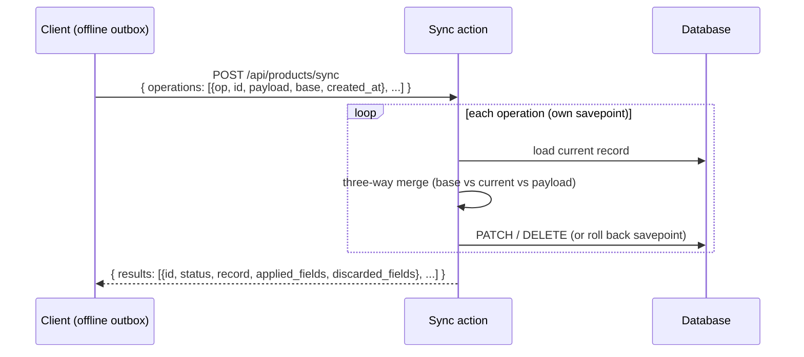

# Offline Sync

**Batch replay of buffered offline writes with server-side conflict resolution**

Offline-first clients keep working while disconnected: they read from a local replica and buffer their writes in an outbox. When connectivity returns, they replay that outbox against the server. The Offline Sync action gives them a single, transactional endpoint per model to apply a batch of buffered **updates** and **deletes**, resolving concurrent server changes with a per-field three-way merge.

It is an opt-in action of the [API Routes Generator](../api-routes/overview.md): enable it on a model and a `POST /.../sync` endpoint appears next to the standard CRUD routes.

## Key Features

- **Batch replay**: apply up to 500 buffered operations in one request
- **Transactional, per-operation isolation**: each operation runs in its own savepoint — an applicative failure rejects only that operation, the rest of the batch still applies
- **Three-way merge**: each operation carries the `base` snapshot the client last knew; disjoint fields from both sides survive, overlapping fields resolve last-writer-wins
- **Block text merge**: long-text fields declared with `merge_blocks=True` merge line-by-line (diff3) instead of dropping a whole side
- **Permission-aligned**: allowed operations follow the model's route configuration — a model without `patch` (resp. `delete`) rejects `update` (resp. `delete`) sync operations
- **Reusable in custom routes**: call `sync_items_action(...)` with a pre-scoped queryset to restrict the reachable records (multi-tenant safe)

## Why not just replay through PATCH / DELETE?

Replaying a buffered outbox one call at a time over the standard routes has three problems the sync action solves:

- **No conflict awareness**: a plain `PATCH` overwrites whatever the server changed meanwhile. Sync compares against the client's `base` snapshot and only overwrites fields the client actually touched, keeping concurrent server edits on the other fields.
- **No batching**: one round-trip per operation is slow over a flaky link. Sync applies a whole batch in a single transactional request.
- **No structured outcome**: the client needs to know, per operation, whether it applied, partially merged, or was refused — to clear the outbox, surface a conflict, or drop a poisoned entry. Sync returns a typed result for every operation.

Creates are intentionally **not** handled here: they often carry model-specific semantics (factories, side effects, id allocation) and stay on their regular `POST` route.

## The protocol at a glance

Each operation is one buffered write:

| Field | Meaning |
|-------|---------|
| `op` | `"update"` or `"delete"` |
| `id` | server id of the target record |
| `payload` | the buffered field changes (update only) |
| `base` | snapshot of the record as the client last knew it — the merge baseline |
| `created_at` | client-side timestamp of the buffered write — the tie-breaker for last-writer-wins |

## Operation statuses

Every operation gets exactly one result status:

| Status | Meaning |
|--------|---------|
| `applied` | applied cleanly (record patched, or record deleted, or an idempotent delete of an already-gone record) |
| `merged` | partially applied — some fields written (`applied_fields`), others lost to fresher server state (`discarded_fields`) |
| `conflict` | nothing applied — the whole operation lost to a fresher server write; the current server `record` is returned so the client can reconcile |
| `deleted` | the target record no longer exists server-side (an `update` aimed at a record deleted meanwhile) |
| `rejected` | the operation failed (validation, permission, integrity) — its savepoint was rolled back; `detail` explains why |

## Assumed limitations

- **Last-writer-wins crosses two clocks**: the tie-breaker compares the server `updated_at` against the client `created_at`. Device and server clocks are not the same clock — treat it as best-effort ordering, not a total order.
- **No base means whole-operation LWW**: an operation without a `base` snapshot cannot isolate disjoint fields — the entire payload is treated as conflicting and resolved as one.
- **Creates stay on `POST`**: only updates and deletes are replayed here.

## Get Started

[Usage Guide](guide.md){ .md-button .md-button--primary }
[API Routes Generator](../api-routes/overview.md){ .md-button }
